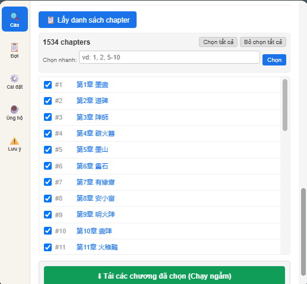
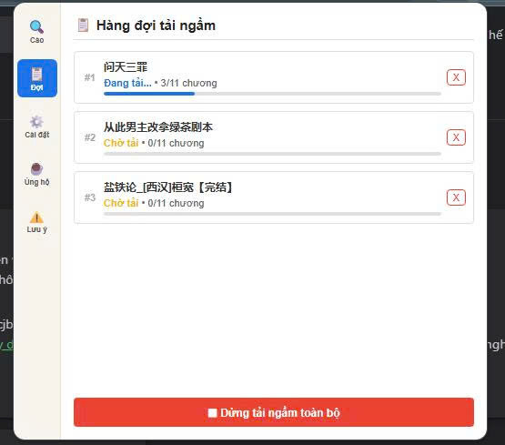
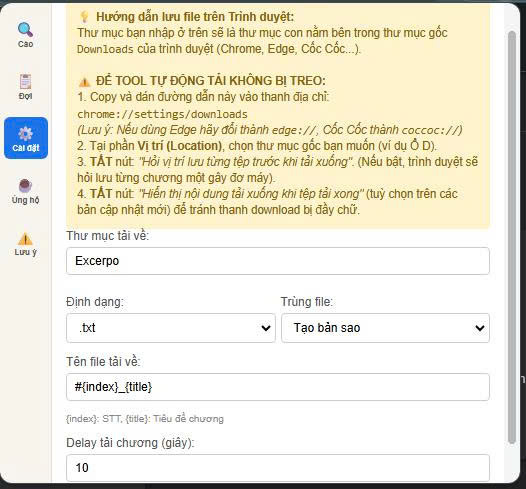
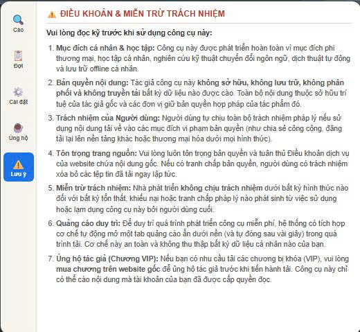
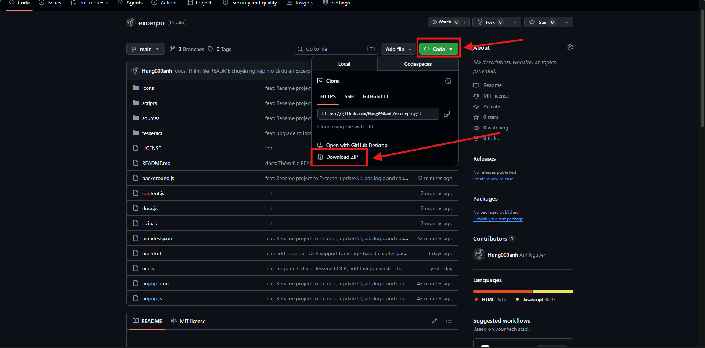
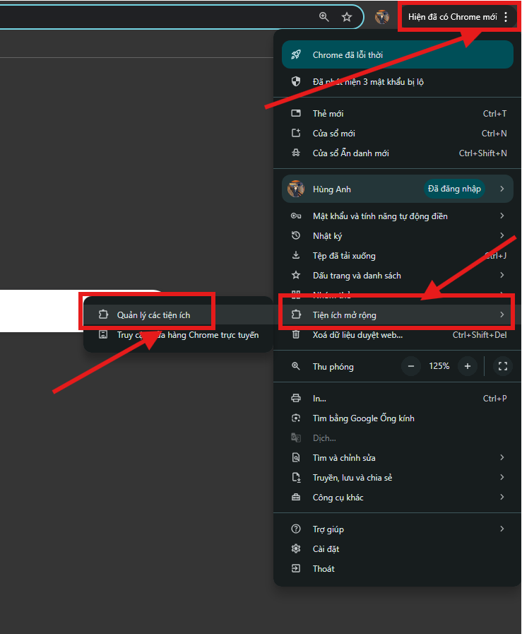
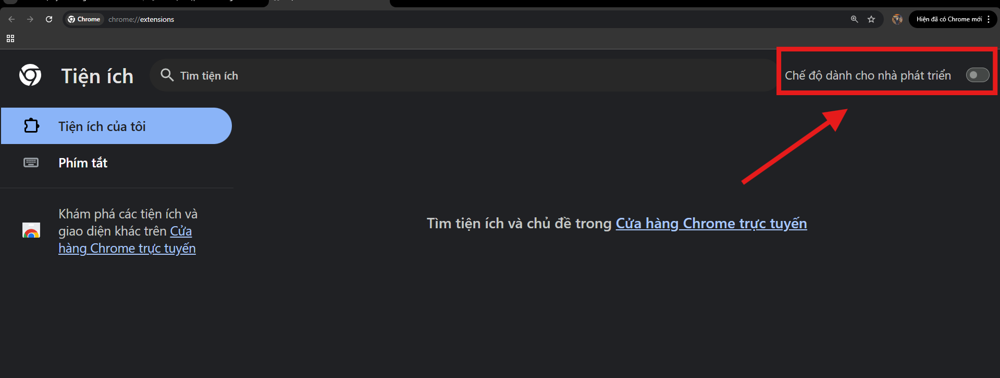
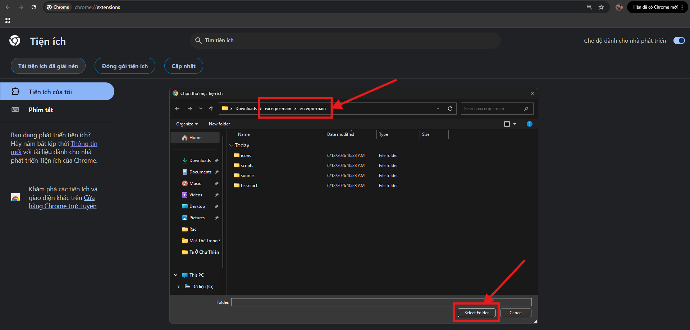
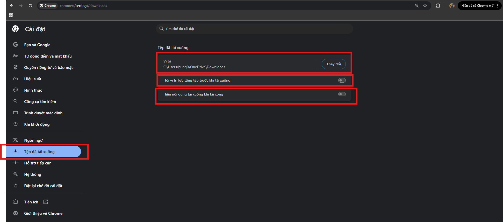
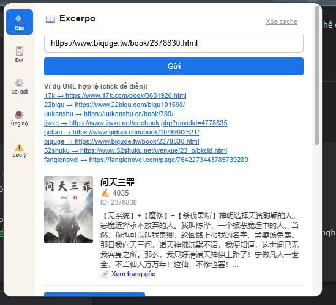

#  Excerpo
**跨平台小说/文本自动提取与下载工具**

---
[Tiếng Việt](README.md) | [English](README_EN.md) | [简体中文](README_ZH.md)
---

## 🌟 简介
**Excerpo**（拉丁语：“提取”，“收获”）是一款功能强大的浏览器扩展（Browser Extension），专门设计用于从各大主流阅读网站上自动收集和提取文本及小说内容。

本工具的主要目的是服务于个人离线存储、语言处理技术研究以及自动翻译支持。

## 📷 屏幕截图

| 🎯 主界面（爬取数据） | ⚡ 章节列表（后台下载） |
| :---: | :---: |
|  |  |
| **⏳ 后台下载队列（进度管理）** | **⚙️ 设置面板（格式和目录）** |
|  |  |
| **☕ 支持开发（赞赞助）** | **⚠️ 条款与免责声明** |
|  |  |

## 🚀 核心功能
* **多平台支持：** 支持扫描和流畅下载全球多个国家的小说网站：
  -  **中国（简体）：** `17k`, `22biqu`, `23qb`, `52shuku`, `69shuba`, `69shumi`, `biquge`, `xbiquge`, `bookqq`, `fanqienovel`, `hetushu`, `ihuaben`, `ixdzs8`, `jjwxc`, `novel543`, `powanjuan`, `qidian`, `shubaow`, `shuhaige`, `uukanshu`, `xbanxia`。
  -  **中国台湾（繁体）：** `po18`, `sto9`, `sto55`, `ttkan`, `twkan`。
  -  **日本：** `kakuyomu`, `pixiv`, `syosetu`, `syosetu.org`。
  -  **欧美/全球：** `ao3`, `fictionpress`, `foxaholic`, `lnmtl`, `novellunar`, `royalroad`, `scribblehub`。
  -  **土耳其：** `fenrirscans`。
  -  **俄罗斯：** `ranobelib`。
  -  **巴西：** `centralnovel`, `phoenixnovels`。
  -  **印度尼西亚：** `meionovel`, `novelgo`, `wbnovel`。
  -  **法国：** `chireads`。
* **自动绕过频率限制与验证码：** 内置后台 OCR (Tesseract.js) 识别数据抓取过程中的验证码，配合智能延迟算法防止 IP 被封锁。
* **后台多线程下载：** 通过 Service Worker 独立在后台运行。您可以正常浏览网页或关闭标签页，工具将耐心下载成千上万个章节。
* **文件和格式自定义：** 支持提取为标准文本 `.txt`、Word `.docx` 或轻量级 `.epub` 电子书。完全支持利用 `{index}`（章节序号）和 `{title}`（章节标题）来自定义文件名命名规则（如：`chuong-{index}_{title}` -> `chuong-1_Khai_thien`，或 `Chapter {index} - {title}` -> `Chapter 1 - Khai thien`）。

## ⚙️ 安装教程
由于这是开发者版本，您可以通过浏览器的**开发者模式**轻松安装此扩展。
1. 点击绿色的 `Code` 按钮 -> **Download ZIP** 并将文件夹解压到电脑上。
    
2. 打开浏览器并访问扩展管理页面（或点击下面的链接之一）：
   * Chrome：`chrome://extensions/`
   * Edge：`edge://extensions/`
   * Coc Coc：`coccoc://extensions/`
    
3. 开启右上角的 **开发者模式 (Developer mode)**。
    
4. 点击 **加载已解压的扩展程序 (Load unpacked)**，并选择解压出来的 Excerpo 文件夹。
    
5. 点击浏览器上的扩展图标，并选择固定（Pin）Excerpo 扩展。
    
6. 尽情体验吧！祝你好运！
    

## ⚠️ 推荐浏览器设置（重要）
为了允许工具自动保存成千上万个文件而不会因为浏览器的下载确认对话框而卡死：
* 访问 `chrome://settings/downloads`。
* 选择保存文件的根文件夹（Excerpo 将自动在此根文件夹内根据小说标题创建子文件夹）。
* **关闭** 选项：*“下载前询问每个文件的保存位置”*。

  

## 📖 使用指南

1. **粘贴小说链接**：前往源网站，复制小说详情页 URL。粘贴到 Excerpo 上的输入框中并点击 **提交**。

  

2. **获取章节列表**：当扩展扫描完小说元数据后，点击 **获取章节列表** 来抓取并显示所有章节。

  

3. **开始后台下载**：选择您想要下载的章节（或在 **快速选择** 框中输入范围，例如 `1-50, 60-70`），然后点击 **下载所选章节（后台）**。

  

4. **管理队列**：在 **队列** 选项卡 (📋) 中跟踪各章节多线程下载的进度。您可以随时停止或取消下载任务。

## 💖 感谢支持者 (Donors)
衷心感谢您的贡献和支持，帮助项目继续发展！

| 赞助者姓名 | 金额 | 赞助日期 |
| :--- | :---: | :---: |
| Nguyễn Thị H*** G**** | 100,000 VND | 24/07/2026 03:27:00 |
| Huỳnh T**** | 50,000 VND | 24/07/2026 16:48:01 |

## ⚖️ 条款与免责声明
Excerpo **免费供个人使用**。为了维持开发成本，当您点击“提交”按钮开始下载时，该工具将自动在后台打开一个隐藏的广告标签页（并在几秒后自动关闭）。感谢您的支持和理解！

用户在分享下载的数据时应自行承担全部法律责任。
> 如果您需要下载锁定的（VIP）章节，请**购买原站章节**以支持原作者。本工具只能提取您的浏览器已拥有阅读权限的内容。

---
*由 [Hung000anh](https://github.com/Hung000anh) 开发 - ☕ 感谢您的陪伴！*
